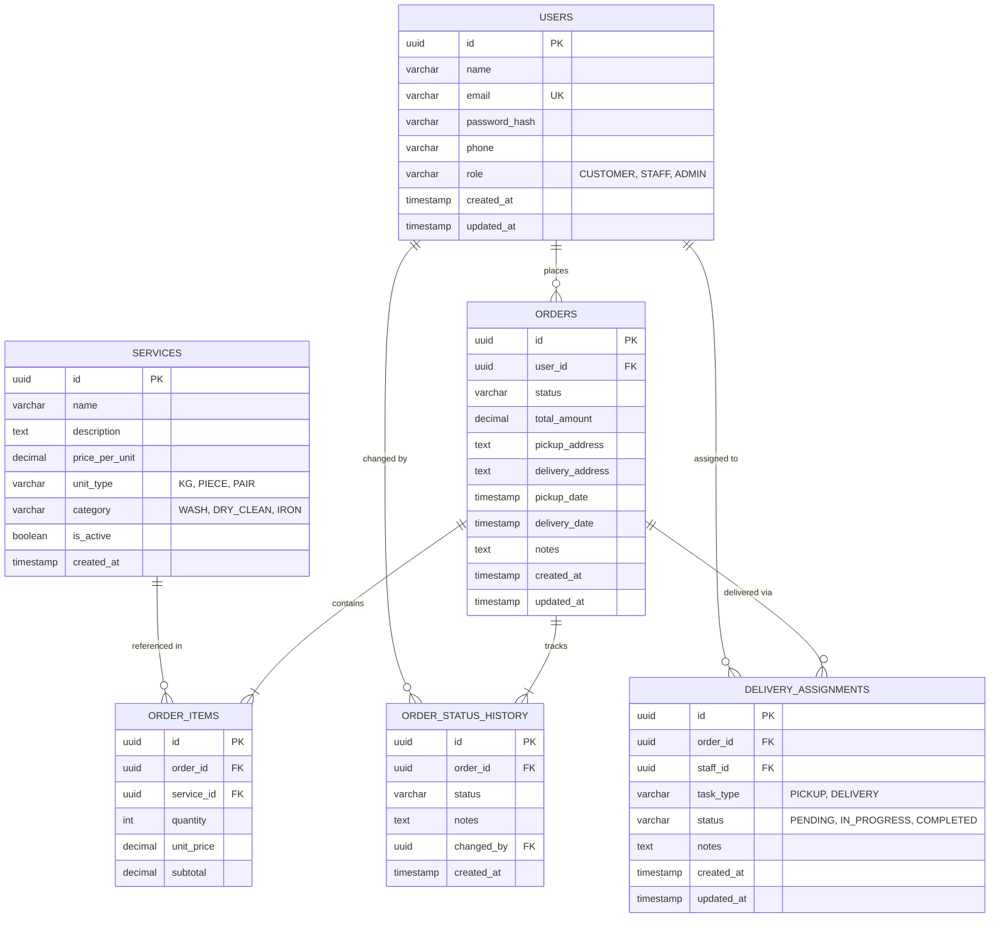

# 🗄️ Database ER Diagram

```mermaid
erDiagram
    USERS ||--o{ ORDERS : "places"
    USERS ||--o{ DELIVERY_ASSIGNMENTS : "assigned to"
    USERS ||--o{ ORDER_STATUS_HISTORY : "changed by"
    SERVICES ||--o{ ORDER_ITEMS : "referenced in"
    ORDERS ||--|{ ORDER_ITEMS : "contains"
    ORDERS ||--|{ ORDER_STATUS_HISTORY : "tracks"
    ORDERS ||--o{ DELIVERY_ASSIGNMENTS : "delivered via"

    USERS {
        uuid id PK
        varchar name
        varchar email UK
        varchar password_hash
        varchar phone
        varchar role "CUSTOMER, STAFF, ADMIN"
        timestamp created_at
        timestamp updated_at
    }

    SERVICES {
        uuid id PK
        varchar name
        text description
        decimal price_per_unit
        varchar unit_type "KG, PIECE, PAIR"
        varchar category "WASH, DRY_CLEAN, IRON"
        boolean is_active
        timestamp created_at
    }

    ORDERS {
        uuid id PK
        uuid user_id FK
        varchar status
        decimal total_amount
        text pickup_address
        text delivery_address
        timestamp pickup_date
        timestamp delivery_date
        text notes
        timestamp created_at
        timestamp updated_at
    }

    ORDER_ITEMS {
        uuid id PK
        uuid order_id FK
        uuid service_id FK
        int quantity
        decimal unit_price
        decimal subtotal
    }

    ORDER_STATUS_HISTORY {
        uuid id PK
        uuid order_id FK
        varchar status
        text notes
        uuid changed_by FK
        timestamp created_at
    }

    DELIVERY_ASSIGNMENTS {
        uuid id PK
        uuid order_id FK
        uuid staff_id FK
        varchar task_type "PICKUP, DELIVERY"
        varchar status "PENDING, IN_PROGRESS, COMPLETED"
        text notes
        timestamp created_at
        timestamp updated_at
    }
```
